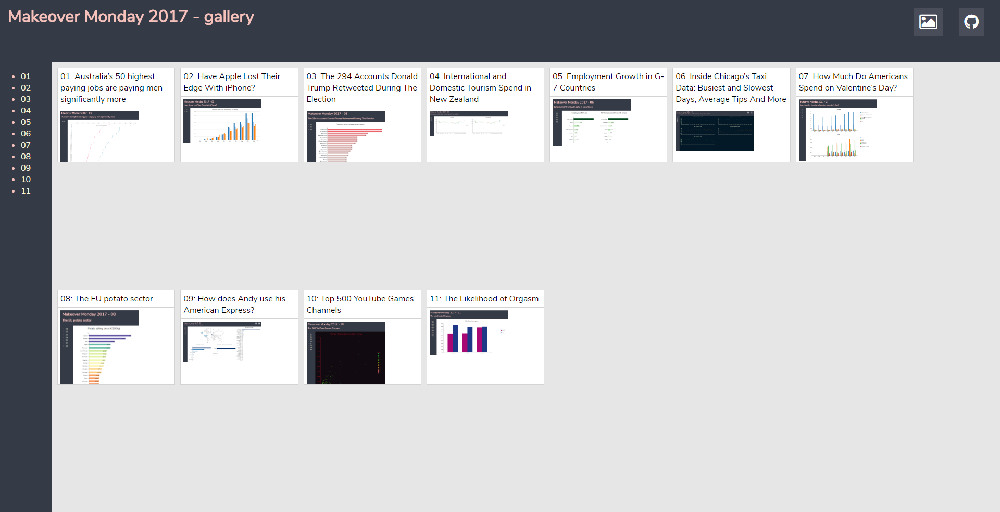

# Makeover Monday 2017

This repository contains all the source code used to create the charts I made in the frame of the [Makeover Monday](http://www.makeovermonday.co.uk/) challenge, year 2017.

All the charts have been realized using [D3](https://d3js.org) (v4), via [ldd3](https://github.com/Ledragon/ldd3) and [TypeScript](https://www.typescriptlang.org/).

